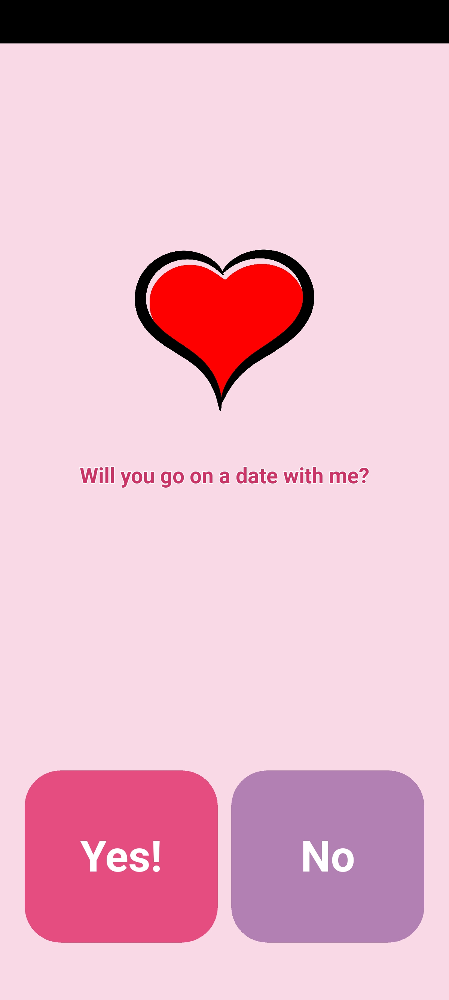
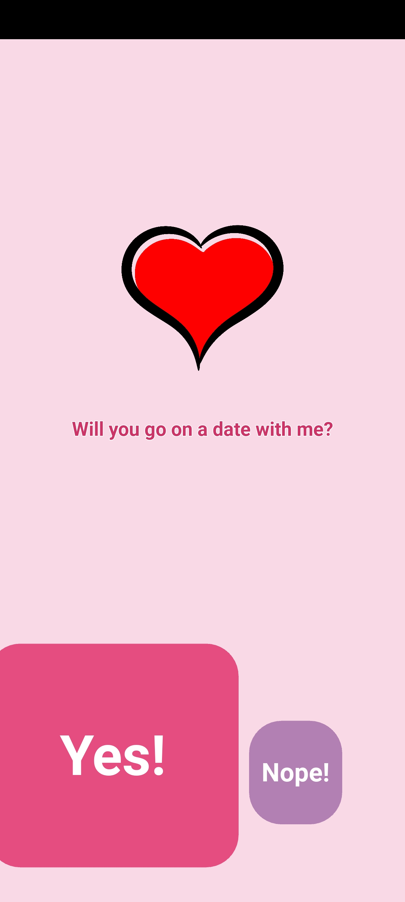
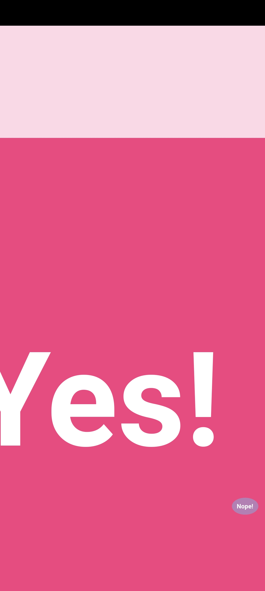
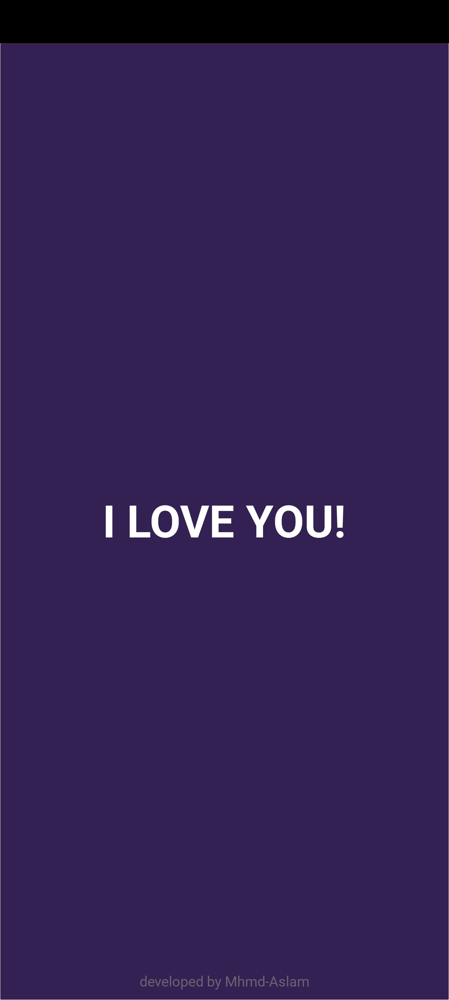

# Love Proposal App ❤️

A romantic interactive proposal app(android|windows) built with Python and Kivy that playfully asks someone on a date, featuring animated buttons and a fullscreen love declaration.

## 📲 Download APK

👉 [Click here to download the APK](https://github.com/Mhmd-Aslam/Love-app/raw/main/bin/loveapp-2.0-arm64.apk)


## Features ✨
- Animated interface with heart graphics
- "Yes" button grows, "No" button moves playfully
- Fullscreen "I LOVE YOU" reveal
- Mobile-responsive design that adapts to screen sizes
- Custom rounded buttons with proportional text scaling

## Requirements 📋
- Python 3.7+
- Kivy 2.0.0+
- Buildozer (for Android APK)

## Installation 🛠️
```bash
git clone https://github.com/Mhmd-Aslam/love-app.git
cd love-app
pip install kivy
```

## Usage 🚀
```bash
python main.py
```
- "Yes!" reveals a fullscreen love declaration
- "No" button shrinks, moves, and disappears after  clicks

## Customization 🎨
Modify colors, messages, button behaviors, and images in the `logos` folder.


## Contributing 🤝
Open an issue or submit a pull request for improvements.

## 📷 Screenshots

<p align="left">
  
  
  
  
  
</p>

## License 📄
Licensed under the MIT License.

**Made with ❤️ and Python**
